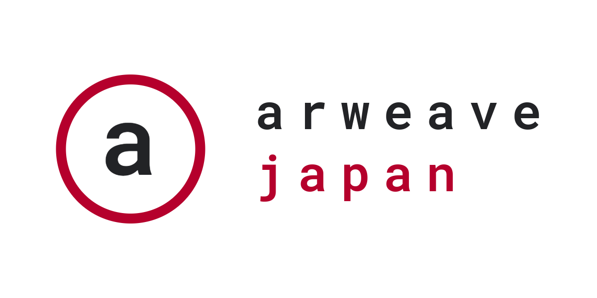

# Arweave Japan とは？

Arweave Japan は [Arweave](https://arweave.org/) / [AO](https://ao.arweave.dev/) の日本語ビルダーエコシステム構築を目的とした分散型組織です。

## ミッション

- Arweave / AO を活用して多様な開発ができるハッカーを多数養成
- 日本エコシステムからグローバルのトッププロジェクトを多数輩出
- グローバルトッププロジェクトを日本エコシステムへ誘致
- Arweave / AO プロダクトの一般ユーザー、企業、行政へのアダプション促進

## ロードマップ

以下の大まかなスケジュールを通じて日本からグローバルで最低１０の AO トッププロジェクト輩出を目指します。

- [Hyper Parallel 東京イベント](https://lu.ma/9k7uzemx) | Arweave Japan キックオフ （2024年7月27日）
- [AO ブートキャンプ](https://lu.ma/w45bzjix) （2024年8月）
- AO ハッカソン （2024年9月）
- Arweave 公式日本カンファレンス （2025年春）

## Arweave / AO クイック入門

- [Arweave / AO リソースまとめ](../docs/resources.md)
- [Arweave / AO 開発入門](../docs/quick-start.md)
- [AO ブートキャンプ Vol.01](../docs/bootcamp/vol_01.md)

## エコシステムパートナー募集

Arweave Japan は Arweave / AO での開発に興味関心をお持ちのエコシステムパートナー様を募集しています。

- 開発アイデア壁打ち
- 技術支援
- 資金調達支援
- グローバル進出支援
- エコシステムイベント優待

## リンク

- [X アカウント (@arweavejp)](https://x.com/arweavejp)
- [ディスコード](https://discord.gg/bB4N7fAMmp)
- [メンバートークン取得](https://arweave.jp)
- [ロゴのダウンロード](https://logo.arweave.jp)
